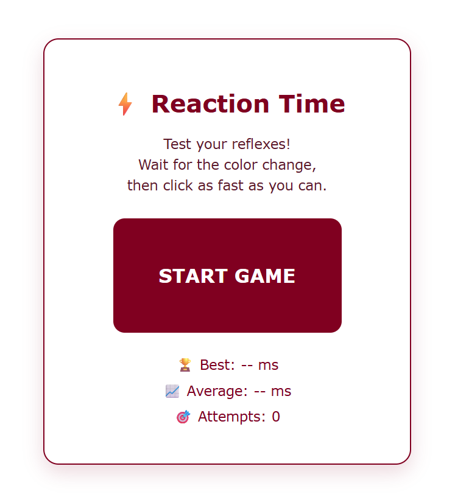

# ⚡ Reaction Time Tester

A fun JavaScript mini-game that measures how fast you can react to a color change.

The game waits for a random amount of time, changes color, and calculates your reaction speed in milliseconds.

## 🎮 How It Works

1. Click **START GAME**
2. Wait for the box to change color
3. Click as quickly as possible
4. Get your reaction time score

## ✨ Features

- ⚡ Random reaction timing
- 🎯 Reaction speed calculation in milliseconds
- 🚨 Early click detection
- 🏆 Best score tracking
- 📈 Average reaction time
- 🎮 Attempts counter
- 🥇 Performance rating system

## 🛠️ Built With

- HTML5
- CSS3
- JavaScript

## 📚 What I Learned

- DOM manipulation
- Event listeners
- setTimeout() and timers
- JavaScript variables and conditions
- Working with browser localStorage
- Updating UI dynamically

## 🚀 Future Improvements

- Add reaction history
- Add animations and sound effects
- Add leaderboard system
- Add dark mode

